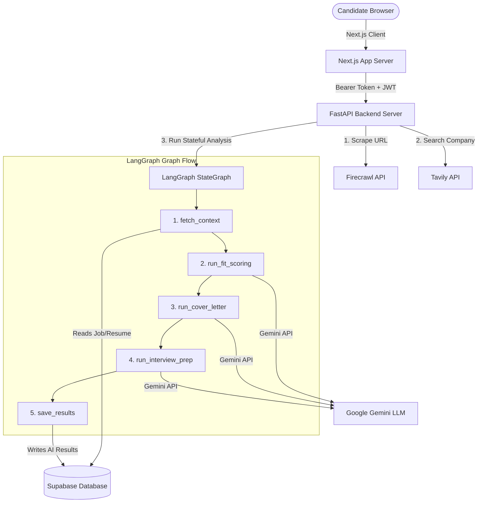

# ✈️ JobPilot

JobPilot is a premium, AI-powered job application management platform (CRM) designed to assist job seekers in matching their profiles to job descriptions, performing automated company research, and generating personalized application assets (cover letters and interview prep guides).

It combines a **Next.js App Router** frontend with a **FastAPI** backend, orchestrated using **LangChain** and **LangGraph** to process candidate resumes and job postings through stateful multi-step pipelines.

---

## 🚀 Key Features

* **Stepped Job Importing**: Scrapes raw job postings via **Firecrawl** and conducts automated search queries using **Tavily** to build comprehensive company overview notes.
* **Stateful Analysis Pipelines**: Employs **LangGraph** to run three specialized LLM chains sequentially:
  1. **Fit Scoring**: Benchmarks candidate skills and experience against job requirements, returning matched skills, missing skills, and a suitability score (0-100%).
  2. **Cover Letter Generator**: Generates a tailored 3-paragraph cover letter using details from the scraped job description, resume, and Tavily company research.
  3. **Interview Prep Guide**: Compiles a customized prep sheet containing exactly 8 behavioral and technical questions, paired with specific answering strategies.
* **CRM Applications Dashboard**: A dark-themed Next.js CRM table displaying job status badges (saved, applied, interview, offer, closed), KPI cards, search controls, and live fit score progress bars.
* **Dynamic Tab Detail Views**: Inspect fit analytics, copy cover letters to the clipboard, and study prep materials with interactive accordion lists.
* **Secure Session Auth**: End-to-end user authentication powered by **Supabase Auth** and Next.js SSR middleware.

---

## 🛠️ Tech Stack

### Frontend
* **Core**: Next.js 14 (App Router), React 18, TypeScript, Tailwind CSS
* **Auth**: `@supabase/ssr` (Server-side session validation & route protection middleware)
* **Icons**: `lucide-react`

### Backend
* **API Framework**: FastAPI, Pydantic v2 (Settings validation)
* **Orchestration**: LangGraph (StateGraph workflows), LangChain (LCEL chains)
* **AI Provider**: Google Gemini API (`gemini-2.5-flash`)
* **Integrations**: Firecrawl (Markdown scraping), Tavily API (Company research search queries)
* **Database**: Supabase Python Client (anon key validation + bypass RLS service role transactions)

---

## 📊 Technical Architecture



---

## 📁 Repository Structure

```text
jobpilot/
├── backend/                  # FastAPI Backend Code
│   ├── app/
│   │   ├── chains/           # Individual LangChain LLM prompts
│   │   ├── graphs/           # LangGraph StateGraph implementation
│   │   ├── routers/          # API resource routes (jobs, applications)
│   │   ├── config.py         # App environment variables & settings validation
│   │   ├── database.py       # Supabase client setup & auth dependencies
│   │   └── main.py           # FastAPI app entry point
│   ├── tests/                # Automated pytest modules
│   └── requirements.txt      # Python backend dependencies
│
├── frontend/                 # Next.js Frontend App
│   ├── src/
│   │   ├── app/              # Router paths (login, signup, applications)
│   │   ├── components/       # Table, stats, modal, and detail layouts
│   │   └── lib/              # Supabase browser configs & backend fetch wrappers
│   ├── next.config.js        # Root env mapping configuration
│   ├── package.json          # Node dependencies & scripts
│   └── tailwind.config.js    # Styling configuration
│
├── schema.sql                # Supabase database table definitions
└── .env.example              # Central configuration environment variables template
```

---

## ⚙️ Configuration & Setup

### 1. Database Setup
Ensure your Supabase project contains the tables defined in `schema.sql`. You can execute these definitions in the Supabase SQL editor:
```bash
# Run schema definitions
psql -h Your-Db-Host -U postgres -d postgres -f schema.sql
```
*Note: Make sure to grant table permissions to the service role if RLS is enabled:*
```sql
GRANT SELECT, INSERT, UPDATE, DELETE ON ALL TABLES IN SCHEMA public TO service_role;
```

### 2. Environment Setup
Create a single `.env` file at the **project root** directory.
```bash
cp .env.example .env
```
Fill in the credentials:
```ini
# LLM Provider
AI_PROVIDER=gemini
AI_MODEL=gemini-2.5-flash
GOOGLE_API_KEY=your-google-api-key

# Scraping & Search APIs
FIRECRAWL_API_KEY=your-firecrawl-api-key
TAVILY_API_KEY=your-tavily-api-key

# Supabase Credentials
SUPABASE_URL=https://your-project.supabase.co
SUPABASE_KEY=your-anon-public-key
SUPABASE_SERVICE_KEY=your-service-role-key

# Next.js Frontend Configuration (Exposed to Browser)
NEXT_PUBLIC_SUPABASE_URL=https://your-project.supabase.co
NEXT_PUBLIC_SUPABASE_ANON_KEY=your-anon-public-key
NEXT_PUBLIC_API_URL=http://localhost:8085
```

### 3. Backend Installation
Navigate to the `backend` folder, set up a virtual environment, and install dependencies:
```bash
cd backend
python3 -m venv .venv
source .venv/bin/activate
pip install -r requirements.txt
```
To launch the FastAPI dev server:
```bash
uvicorn app.main:app --port 8085 --reload
```

### 4. Frontend Installation
Navigate to the `frontend` folder, install dependencies, and start the development server:
```bash
cd frontend
npm install
npm run dev
```
Open `http://localhost:3000` in your browser.

---

## 🧪 Running Verification Tests

To verify that the LangGraph workflow and Gemini connections work correctly, run the integration validation script from the `backend` directory:
```bash
# Set up a TEST_APPLICATION_ID in .env to run real end-to-end validations
cd backend
source .venv/bin/activate
python scratch/test_graph.py
```

---

## 📄 License
This project is licensed under the MIT License - see the LICENSE file for details.
