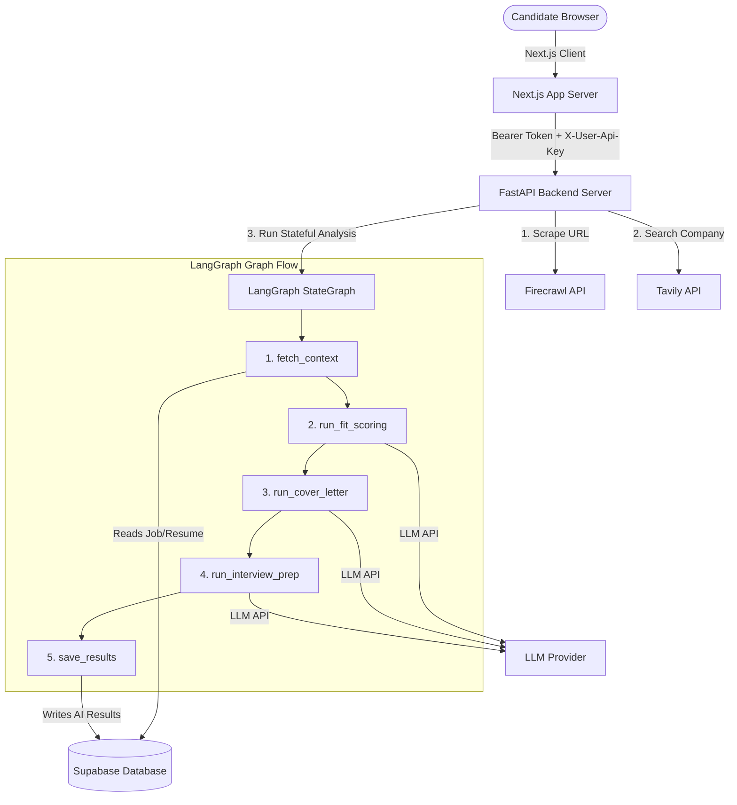

# ✈️ JobPilot

JobPilot is a premium, AI-powered job application management platform (CRM) designed to assist job seekers in matching their profiles to job descriptions, performing automated company research, and generating personalized application assets (cover letters and interview prep guides).

It combines a **Next.js App Router** frontend with a **FastAPI** backend, orchestrated using **LangChain** and **LangGraph** to process candidate resumes and job postings through stateful multi-step pipelines.

---

## 🚀 Key Features

* **Stepped Job Importing**: Scrapes raw job postings via **Firecrawl** and conducts automated search queries using **Tavily** to build comprehensive company overview notes.
* **Stateful Analysis Pipelines**: Employs **LangGraph** to run three specialized LLM chains sequentially:
  1. **Fit Scoring**: Benchmarks candidate skills and experience against job requirements, returning matched skills, missing skills, and a suitability score (0-100%).
  2. **Cover Letter Generator**: Generates a tailored 3-paragraph cover letter using details from the scraped job description, resume, and Tavily company research.
  3. **Interview Prep Guide**: Compiles a customized prep sheet containing customized behavioral and technical questions, paired with specific answering strategies.
* **CRM Applications Dashboard**: A dark-themed Next.js CRM table displaying job status badges (saved, applied, interview, offer, closed, rejected), KPI cards, search controls, and live fit score progress bars.
* **Dynamic Tab Detail Views**: Inspect fit analytics, copy cover letters to the clipboard, study prep materials with interactive accordion lists, and manage application reminders.
* **Secure Session Auth**: End-to-end user authentication powered by **Supabase Auth** and Next.js SSR middleware.
* **Dynamic API Key Settings & Security**: Configure personal LLM API keys securely in the Settings panel. Stored locally in the browser (`localStorage`), the key is loaded in memory and sent via headers for analysis runs. It is never stored in the database, preventing leaks and preserving user privacy.
* **Resume Management**: A dedicated page for listing, uploading, parsing, updating, and deleting multiple saved resumes. Users select from their saved resume profiles directly inside the job import modal, streamlining job tracking.

---

## 🛠️ Tech Stack

### Frontend
* **Core**: Next.js 15 (App Router), React 19, TypeScript, Tailwind CSS
* **Auth**: `@supabase/ssr` (Server-side session validation & route protection middleware)
* **Icons**: `lucide-react`

### Backend
* **API Framework**: FastAPI, Pydantic v2 (Settings validation)
* **Orchestration**: LangGraph (StateGraph workflows), LangChain (LCEL chains)
* **AI Provider**: Google Gemini, OpenAI, Anthropic, Groq, local/VPS OpenAI-compatible runners (Ollama, vLLM, LM Studio), or local **mock** provider for sandbox/visual testing.
* **Integrations**: Firecrawl (Markdown scraping), Tavily API (Company research search queries)
* **Database**: Supabase Python Client (anon key validation + bypass RLS service role transactions)

---

## 📊 Technical Architecture



---

## 📁 Repository Structure

```text
jobpilot/
├── backend/                  # FastAPI Backend Code
│   ├── app/
│   │   ├── chains/           # Individual LangChain LLM prompts
│   │   │   ├── cover_letter.py
│   │   │   ├── fit_scoring.py
│   │   │   └── interview_prep.py
│   │   ├── graphs/           # LangGraph StateGraph implementation
│   │   │   └── analysis_graph.py
│   │   ├── routers/          # API resource routes (jobs, applications, reminders, resumes)
│   │   │   ├── applications.py
│   │   │   ├── jobs.py
│   │   │   ├── reminders.py
│   │   │   └── resumes.py
│   │   ├── config.py         # App environment variables & settings validation
│   │   ├── database.py       # Supabase client setup & auth dependencies
│   │   ├── llm.py            # LLM provider factory, key validator & sanitizer
│   │   ├── rate_limiter.py   # IP-based rate limiter dependency
│   │   ├── schemas.py        # Pydantic v2 schemas for request/response serialization
│   │   └── main.py           # FastAPI app entry point
│   ├── tests/                # Automated pytest modules
│   │   ├── conftest.py
│   │   ├── integration/      # Integration test flows (analyze, import, reminders)
│   │   └── unit/             # Unit tests (chains, resume parser, status check)
│   └── requirements.txt      # Python backend dependencies
│
├── frontend/                 # Next.js Frontend App
│   ├── src/
│   │   ├── app/              # Router paths (login, signup, settings, applications, resumes)
│   │   ├── components/       # UI elements (Sidebar, stats, tables, tabs, modals)
│   │   └── lib/              # Client utilities (supabase, api client, analysisTracker)
│   ├── next.config.js        # Root env mapping configuration
│   ├── package.json          # Node dependencies & scripts
│   └── tailwind.config.js    # Styling configuration
│
├── schema.sql                # Supabase database table definitions
└── .env.example              # Central configuration environment variables template
```

---

## ⚙️ Configuration & Setup

### 1. Database Setup
Create tables in your Supabase project using `schema.sql`. You can execute these definitions in the Supabase SQL editor. The schema file automatically configures:
- Row-Level Security (RLS) policies for user data isolation
- Necessary indices for quick sorting and querying
- Schema permission grants and cache reload notifications

### 2. Environment Setup
Create a single `.env` file at the **project root** directory.
```bash
cp .env.example .env
```
Fill in the credentials:
```ini
# LLM Provider (options: gemini, openai, anthropic, groq, local, mock)
AI_PROVIDER=gemini
AI_MODEL=gemini-2.0-flash

# (Optional) If using a local or VPS-hosted OpenAI-compatible runner (e.g., Ollama, vLLM, LM Studio)
# AI_PROVIDER=local
# LOCAL_LLM_BASE_URL=http://localhost:11434/v1
# AI_MODEL=qwen2.5-coder:7b

# Task-specific Model Overrides (Optional)
# AI_MODEL_FIT=
# AI_MODEL_LETTER=
# AI_MODEL_PREP=

# Default LLM Provider API Keys
GOOGLE_API_KEY=your-google-api-key
# OPENAI_API_KEY=
# ANTHROPIC_API_KEY=
# GROQ_API_KEY=

# Scraping & Search APIs
FIRECRAWL_API_KEY=your-firecrawl-api-key
TAVILY_API_KEY=your-tavily-api-key

# Supabase Credentials
SUPABASE_URL=https://your-project.supabase.co
SUPABASE_KEY=your-anon-public-key
SUPABASE_SERVICE_KEY=your-service-role-key

# Next.js Frontend Configuration (Exposed to Browser)
NEXT_PUBLIC_SUPABASE_URL=https://your-project.supabase.co
NEXT_PUBLIC_SUPABASE_ANON_KEY=your-anon-public-key
```

### 3. Backend Installation
Navigate to the `backend` folder, set up a virtual environment, and install dependencies:
```bash
cd backend
python3 -m venv .venv
source .venv/bin/activate
pip install -r requirements.txt
```
To launch the FastAPI dev server:
```bash
uvicorn app.main:app --port 8080 --reload
```

### 4. Frontend Installation
Navigate to the `frontend` folder, install dependencies, and start the development server:
```bash
cd frontend
npm install
npm run dev
```
Open `http://localhost:3000` in your browser.

---

## 🔒 Security & Privacy Model

To keep user keys fully confidential, JobPilot uses an **in-memory transaction flow**:
1. User API keys are configured and stored only in browser `localStorage`.
2. When performing analysis, keys are sent directly via the `X-User-Api-Key` request header.
3. FastAPI receives the header, validates the prefix format, sanitizes inputs, and passes it directly to LangChain chat models in memory.
4. No API keys are written to the database, ensuring zero footprint on persistent logs or third-party storage.

---

## 🚦 API Rate Limiting

The backend implements zero-dependency IP-based rate limiting on sensitive actions:
* `POST /api/jobs/import`: **10 requests per minute** (throttles crawler and company search queries).
* `POST /api/applications/{id}/analyze`: **5 requests per minute** (throttles model tokens usage).
* General retrieval and utility routes are throttled at standard caps (e.g. 30 requests/minute).

---

## 🧪 Running Verification Tests

### 1. Pytest Test Suite
To run the automated unit and integration tests (which mock external dependencies like LLMs, databases, and scrapers):
```bash
cd backend
source .venv/bin/activate
python -m pytest
```

### 2. Live Graph Verification (Developer Sandbox)
To run a graph execution script with live APIs and DB connection:
```bash
cd backend
source .venv/bin/activate
# Setup TEST_APPLICATION_ID in environment
python scratch/test_graph.py
```

---

## 📄 License
This project is licensed under the MIT License - see the LICENSE file for details.
